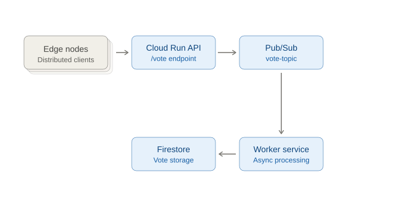

# Distributed Voting System

## Overview
This project implements a distributed voting system using Python, Google Cloud Run, Pub/Sub, and Firestore. It demonstrates edge-to-cloud ingestion, asynchronous processing, idempotency, fault tolerance, and eventual consistency.

## Architecture
Edge Nodes → Cloud Run API → Pub/Sub → Worker Service → Firestore



## Components
- **edge_node.py**: Simulates edge devices generating and sending votes (with intentional duplication for fault testing).
- **main.py**: Cloud Run API that receives votes via HTTP POST at `/vote`, validates them, and publishes to Pub/Sub.
- **workers.py**: Worker service that subscribes to the Pub/Sub topic, processes votes, ensures idempotency, and stores them in Firestore.

## Setup & Running

### 1. Prerequisites
- Python 3.10+
- Google Cloud project with Pub/Sub and Firestore enabled
- Cloud Run deployment for `main.py` (API)
- Service account with Pub/Sub and Firestore permissions

### 2. Install Dependencies
```
pip install -r requirements.txt
```

### 3. Create Pub/Sub Topic and Subscription
```
gcloud pubsub topics create vote-topic
gcloud pubsub subscriptions create vote-subscription --topic=vote-topic
```

### 4. Deploy API to Cloud Run
Deploy `main.py` to Cloud Run. Set the service URL in `edge_node.py` as `API_URL`.

### 5. Run the Worker
```
python workers.py
```

### 6. Run the Edge Node
```
python edge_node.py
```

## Testing & Fault Injection
- The edge node sends each vote 3 times to simulate network-induced duplication.
- Stop the worker to simulate backend failure; Pub/Sub will buffer messages.
- Restart the worker to process queued votes and observe recovery.

## Endpoints
- `POST /vote` (Cloud Run API): Receives vote JSON payloads.

## Firestore Structure
- Collection: `votes`
- Document ID: `{user_id}_{poll_id}`
- Document fields: All vote data

## Example Vote Payload
```json
{
  "user_id": "...",
  "poll_id": "poll_2024_election",
  "choice": "A",
  "timestamp": 1234567890.0,
  "edge_node_id": "node_phil_01"
}
```

## System Evaluation & Performance Analysis

### 1. End-to-End Latency
Under normal operation, latency from edge to Firestore was low (under a few seconds). During worker downtime, latency increased significantly as votes queued in Pub/Sub and were processed in batch upon recovery.

### 2. System Throughput
The system processed votes in near real-time under normal conditions. During worker downtime, throughput dropped to zero, but upon recovery, the worker processed queued votes rapidly.

### 3. Fault Tolerance Behavior
When the worker was stopped, the API and Pub/Sub continued to accept and buffer votes. No votes were lost. After restarting the worker, all queued votes were processed and stored in Firestore.

### 4. Consistency Across Components
Idempotency was enforced using a composite document ID (`user_id` + `poll_id`), ensuring no duplicate records in Firestore even when the same vote was sent multiple times.

### 5. System Trade-Offs
- **Pub/Sub**: Reliability and decoupling, but introduced buffering delay.
- **Cloud Run**: Flexible scaling, but cold starts added slight delay.
- **Edge Computing**: Reduced server load but increased system complexity.
- **Idempotency**: Ensured correctness but required additional logic.

## Individual Reflections

### Abraham Roxas (Ramsky)
I handled the initial repository setup and pushed the main code files for the API, worker, and edge node. The GCP side took a while because I had to enable several APIs, configure the service account, and fix some IAM permissions before the deployment would work. Getting the Cloud Run API to publish to Pub/Sub also gave me some authentication errors at first. Once everything was deployed though, the rest of the system started running smoothly. The most interesting thing for me was seeing the API keep accepting votes even when the worker was disabled — that's when fault tolerance actually clicked.

### Jiane Sarting
I worked on improving the documentation, adding tracking counters and logging to the worker, and making the architecture diagram for the project. Writing the logging part helped me understand how the worker handles each message and how idempotency prevents duplicates. The architecture diagram was useful because it forced me to visualize how all the components actually connect. During testing I noticed the queued votes coming through in a burst once the worker was restored, which was the part that made distributed processing feel real.

### Samuel Vincent Aque
I added the acknowledgments section and helped review the README so the documentation was complete. While testing, I watched how the votes moved from our laptops to Firestore, and it was kinda satisfying seeing the data appear in real time. The part where we stopped the worker on purpose and the system didn't break was when I started to understand what fault tolerance really meant.

### John Lloyd Arvin Bajolo
I worked on cleaning up the documentation formatting and ran the edge node during testing. The setup was confusing at first because of all the services involved, but once the pipeline was running it made more sense. Watching the system recover after we stopped the worker was my favorite part because it showed how distributed systems handle failure without us doing anything manual.
